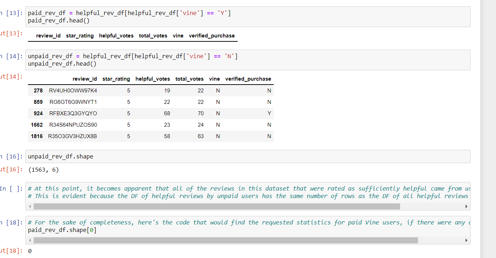
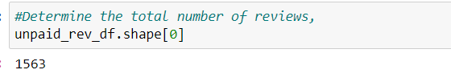
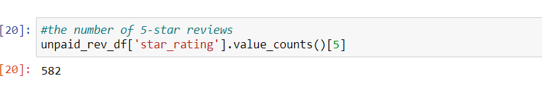
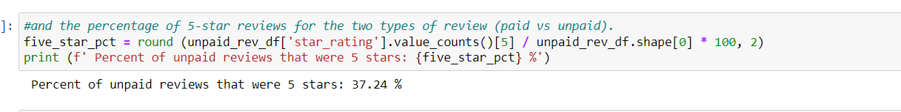

# Amazon_Vine_Analysis
Analysis of Vine reviews using PySpark, AWS, and SQL

## Overview of the analysis
### Purpose of the project
The objective of this project was to contrast Amazon product reviews by paid Vine users against those written by other users. The intent was to determine whether the paid users were susceptible to bias, which would have been reflected in the percentage of their reviews that rated a product at the maximum five stars.

To accomplish this, a set of reviews of digital video games was imported into a dataframe, which was then filtered to contain only reviews that had been voted on 20 times or more, with a rate of at least 50% of the votes deeming the review as helpful. This cleaned dataframe was then exported, and examined to compute the percentage of the remaining reviews from Vine and non-Vine users that gave the product a 5-star rating.

## Results
### Review counts
- The dataset contained zero reviews from Vine users that met the criteria for inclusion in the cleaned dataset.

- 1563 reviews did make it through the cleaning process; all of them were from non-Vine users.

### Counts of 5-star reviews
- Given that there were no reviews from Vine users in the cleaned data, there were no such reviews that gave the product 5 stars.
- Of the non-Vine reviews, 582 were 5-star ratings.

### 5-star review percentage
- 37.24% of the cleaned review data from non-Vine users were 5-star reviews.

- Once again, there was no relevant data in the set from Vine users.

## Summary
### Conjecture on bias
Without any data about Vine users that cleared the criteria in the ETL process, it is unreasonable to draw any conclusions regarding whether Vine reviews show bias toward or against the products. The 37.24% rate of five-star reviews from non-Vine users seems like a reasonable baseline, should any comparable Vine data be obtained.

### Suggestion for additional analysis
The obvious suggestion here would be to obtain a dataset that included some reviews from Vine users. The options for doing so might include lowering the requirements for number of votes and "helpful" percentage, or expanding the dataset to include reviews of games distributed on physical media.